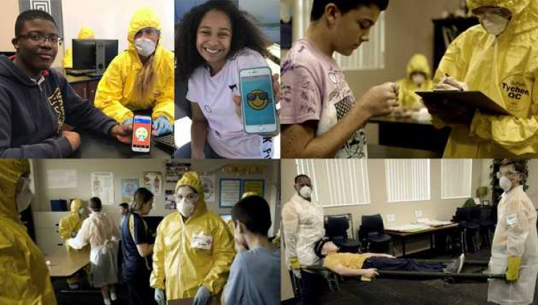
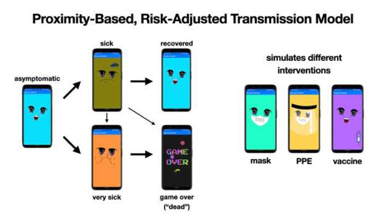
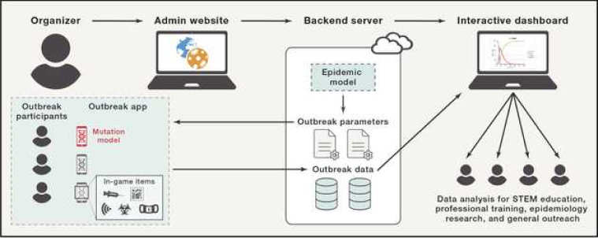

# Digital epidemiology and simulated outbreaks

Here at CoLabo, we study the epidemiology of infectious diseases by applying novel mathematical modeling and computer simulation approaches. We are interested in aggregating heterogeneous data sources, including contact tracing data, clinical symptoms, and population-level variables such as case counts, in order to make risk predictions. We are also developing participatory simulation tools that allow spreading a virtual pathogen using smartphones’ proximity sensing capabilities and generating synthetic epidemiological datasets to be used for model validation. These tools have applications in STEM education as well, by supporting experiential outbreak exercises in various educational settings.

Digital epidemiology, in its broadest definition, is epidemiology that simply uses digital data. More narrowly, it has been defined as “epidemiology that uses digital data collected for non-epidemiological purposes” ([Park et al., 2018](/), [Salathé, 2018](/)). Our current work fits both definitions, but we also envision digital tools such as outbreak simulation games serving a public health purpose by educating participants through gamification and tracking disease spread by anonymous contact tracing and symptom reporting.

## Smartphone-based participatory outbreak simulations

Operation Outbreak is an app-based participatory simulation platform that spreads a virtual “pathogen” via Bluetooth through users’ smartphones. The platform includes other components in addition to the smartphone app, including a web admin tool to configure the simulations and an interactive online dashboard to visualize the simulated data.

The platform started as an experiential learning exercise at a middle school in Florida, which culminated in a two-week civics curriculum on public health and outbreak response. The exercise originally used stickers to simulate pathogen transmission, and it later incorporated a Bluetooth-enabled mobile app that increased realism and flexibility.

## The Operation Outbreak platform

The Operation Outbreak mobile app is driven by a configurable epidemiological model that allows setting different parameters for the simulation, including infectivity, recovery time, and prevalence of various symptoms. This makes it possible to simulate a wide range of pathogens and epidemiological structures (SEIR, SIR, etc.). Interventions such as mask and personal protective equipment, rapid tests, and vaccination can also be incorporated into the simulations. The app’s UI has been designed to make it easy to use and engaging for users in the middle and high-school age range.

Beyond the iOS and Android app itself, the Operation Outbreak platform also comprises a cloud backend database and API that store and manage the parameters and simulation data, a web admin tool that allows teachers and other event organizers to create their own custom simulations, and an interactive online dashboard to visualize and understand the simulated outbreaks. All these components are shown in the following diagram:

